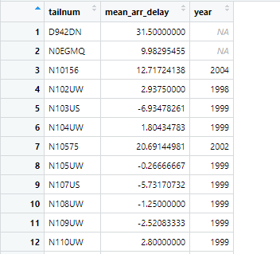

in\_class exercise
================
Yifan Zhang

## Load necessary libraries and look at the data

``` r
library(dplyr)
```

    ## 
    ## Attaching package: 'dplyr'

    ## The following objects are masked from 'package:stats':
    ## 
    ##     filter, lag

    ## The following objects are masked from 'package:base':
    ## 
    ##     intersect, setdiff, setequal, union

``` r
library(tidyr)
library(nycflights13)
```

## Problem 1

Make a table that describes each plane. It should have a column for
tailnum, another column for average arrival delay, and another for the
year the plane was manufactured.

``` r
f <- flights %>%
  group_by(tailnum) %>%
  summarize(mean_arr_delay = mean(arr_delay, na.rm = T)) %>%
  left_join(planes) %>%
  select(tailnum:year)
```

    ## Joining, by = "tailnum"



## Problem 2

Make a table where each row is a day of the year. The first column is
the date. The 2:4 columns give the number of (scheduled) departures from
EWR, LGA, and JFK.

``` r
f1 <- flights %>%
  group_by(origin, month, day)%>%
  summarize(deps = n())%>%
  pivot_wider(names_from=origin,
              values_from = deps)
```

    ## `summarise()` has grouped output by 'origin', 'month'. You can override using the `.groups` argument.


``` r
f2 <- flights%>%
 mutate(date = as.Date(time_hour))%>%
 group_by(origin, date)%>%
 summarize(deps=n())%>%
 pivot_wider(names_from = origin, 
             values_from = deps) 
```

    ## `summarise()` has grouped output by 'origin'. You can override using the `.groups` argument.


## Problem 3

Make a table where each row is a day of the year. Each destination
airport is a column. The elements (day x destination) give the number of
flights to that destination. What should NA’s be?

``` r
f3 <- flights %>%
  mutate(date = as.Date(time_hour))%>%
  group_by(date, dest)%>%
  summarize(deps = n())%>%
  pivot_wider(names_from=dest,
              values_from = deps)
```

    ## `summarise()` has grouped output by 'date'. You can override using the `.groups` argument.


